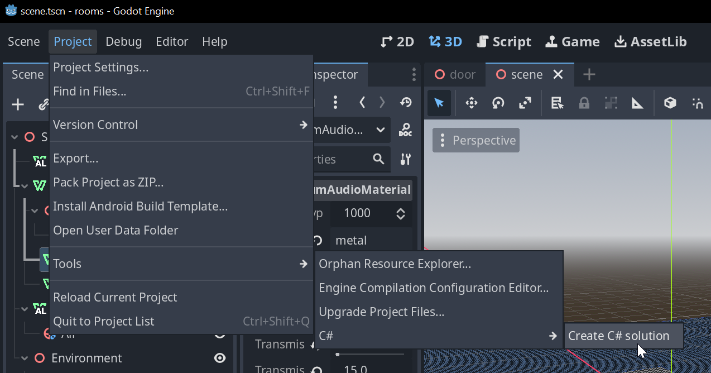
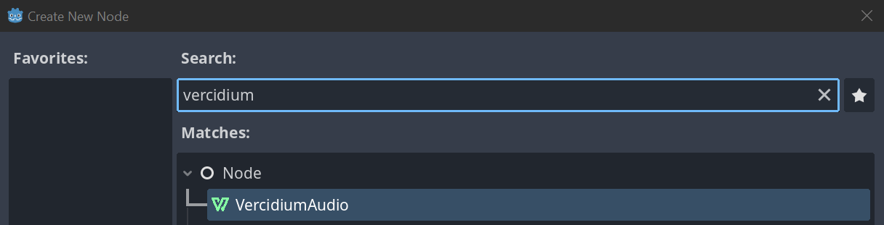
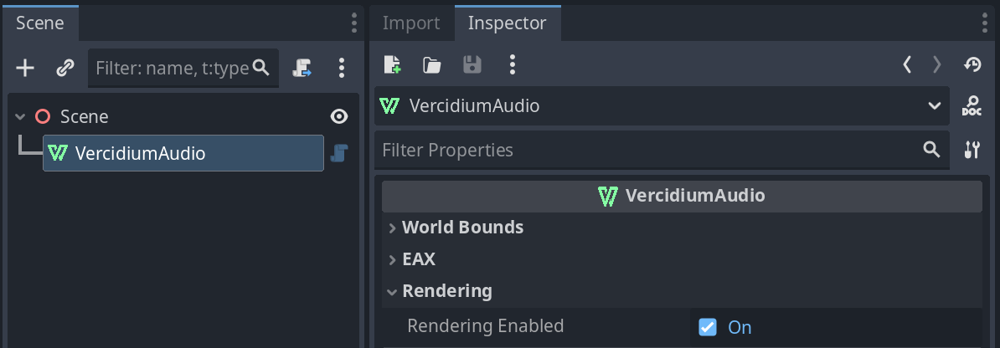
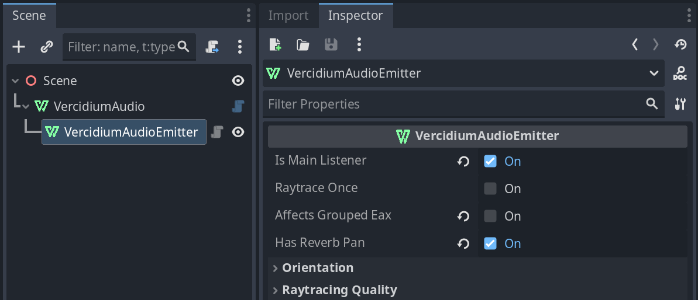
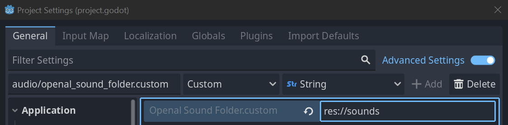

## Godot Raytraced Audio

### Step 1 - Configure Your Godot Project

Open your Godot project and click `Project > Tools > C# > Create C# solution`.



You should now see a `your_game.csproj` file in your project folder. This is required to install the Vercidium Audio plugin in the next step.

### Step 2 - Clone Plugins

Clone the `vaudio-godot-openal` and `godot-openal` repositories to the addons folder:

```bash
cd your_godot_game
mkdir addons
cd addons
git clone git@github.com:vercidium-audio/vaudio-godot-openal.git
git clone git@github.com:vercidium-audio/godot-openal.git
```

You should see both addons in your addons folder:


Open your Godot project and click `Project > Project Settings > Plugins`:
1. Enable "godot-openal"
2. Enable "vaudio-godot-openal"


After this, you should see some output telling you to edit the `.csproj`:

image todo

This is good. Close your Godot project and continue on.

### Step 3 - Configure .csproj

Open your `.csproj` file in a text editor and replace this with the path to your vaudio folder, e.g. `C:/Users/You/Downloads/vaudio_v1_2_0`

```xml
<PropertyGroup>
	<!-- Replace this with the path to your vaudio SDK -->
	<VAudioDir>path/to/vaudio</VAudioDir>
</PropertyGroup>
```

### Step 4 - Verify Installation

Re-open your Godot project and build it. You should see these files in your `.godot\mono\temp\bin\Debug` build directory:


### Step 5 - Add Main Nodes
In your main scene, add a `VercidiumAudio` node:



The `VercidiumAudio` node has a few settings that you can customise. For now I recommend enabling `Rendering Enabled` and leaving the other settings as is:



> The ALManager node is added automatically as an autoload. Read more on the [godot_openal](https://github.com/vercidium-audio/godot-openal) repository. 

## Step 6 - Create a Listener

Create a `VercidiumAudioEmitter` node within your `VercidiumAudio` node, and set:
- `Is Main Listener` to true
- `Raytrace Once` to false
- `Affects Grouped EAX` to false
- `Has Reverb Pan` to true



There can only be one main listener. This emitter will cast reverb, occlusion, permeation and ambient permeation rays. You can adjust the number of rays in the `Raytracing Quality` section below `Has Reverb Pan`.

This emitter is a Node3D, and you can adjust its position to control where rays originate from. In my demos, I wrap the listener in another Node3D, which has a script to align the listener emitter with the camera:

```py
extends Node3D

func _process(_delta: float) -> void:
	var camera = get_viewport().get_camera_3d()

	if camera:
		global_position = camera.global_position

        # Change this to the name of your listener node
		var emitter = get_node("Listener")
		if emitter:
			var rot = camera.global_rotation
			emitter.set("Pitch", rot.x)
			emitter.set("Yaw", rot.y)
```

The full setup now looks like this:


## Step 7 - Sound Playback

To play a 3D sound with raytracing automatically applied, create a new `VercidiumAudioSource` node in your scene.


Set its `Sound Name` to the path of your sound in the `res://audio` folder, and set `Play When Raytracing Completes` to play the sound automatically when it is raytraced.

For short sounds I recommend setting `Raytrace Once` to true, as it's enough to just raytrace the source once to figure out how muffled it is. For longer continuous sounds like music or speech, set `Raytrace Once` to false to ensure they are automatically muffled/clear as the environment changes.

If your sound files live in a different folder, you can set a custom path using the `audio/openal_sound_folder.custom` setting:



## Step 8 - Add Materials to Primitives

For a 3D object to affect raytracing, it must have a `vercidium_audio_material` string metadata field. 

Materials also apply to child nodes. In the screenshot below, I've set a `concrete` material on the `Building` node, which sets the material of every child node to `concrete`. To exclude a child node from raytracing, set its material to `air`.


> To ensure your scene is set up correctly, set `Rendering Enabled` to true on your `VercidiumAudio` node. This will display a debug window that shows all primitives with materials.

## Step 9 - Customise Materials

To create a new material, add a `VercidiumAudioMaterial` child node to the VercidiumAudio node:


Set `Material Name` to a custom string, e.g. `'alien'`, and then set the `vercidium_audio_material` metadata field to `alien` on a 3D primitive.

See the [default material properties](https://docs.vercidium.com/raytraced-audio/v110/Materials#Default+Material+Properties) for reference values.

You can also edit the default materials by setting the `Material Name` to the same name as a [default material](https://docs.vercidium.com/raytraced-audio/v110/Enums/MaterialType). The material name must be all lowercase, e.g. 'concrete', 'woodindoor', 'metal'.
