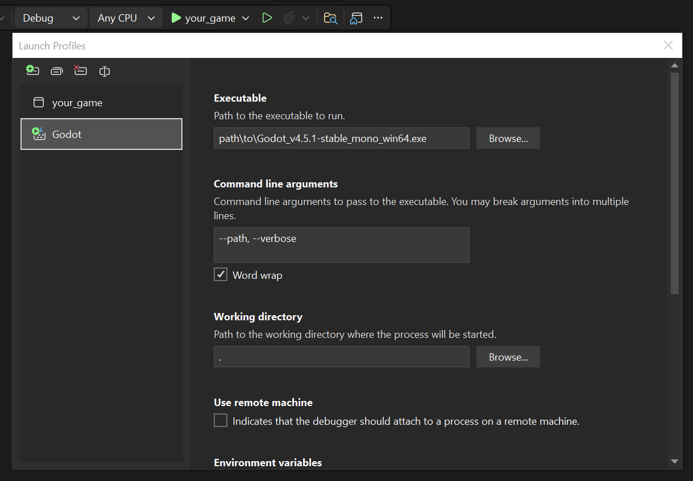

# Vercidium Audio

Raytraced audio plugin for Mono Godot 4 with realistic muffling, reverb, ambience and visualisation. Uses OpenAL Soft for playback, spatialisation, filters and effects.

For Standard Godot (not C#), please use [this plugin](https://github.com/vercidium-audio/vaudio-godot-native-openal-3d-release/releases).

## Features

- Muffle sounds in real time
- Accurate reverb in any environment
- Innovative event-based raytracing system
- Realistic energy-based model using materials
- Dynamic scene updates - automatically handles moving objects

## Requirements

This repository requires Vercidium Audio v1.9.0 and OpenAL Soft to run:
- Download the Vercidium Audio SDK from [vercidium.com](https://vercidium.com)
- Download the OpenAL Soft DLL from [github.com/kcat/openal-soft](https://github.com/kcat/openal-soft/releases/tag/1.25.2)

> Please note that the Vercidium Audio SDK is not free for commercial use. See [vercidium.com/eula](https://vercidium.com/eula)

## References
- [Vercidum Audio documentation](https://vercidium.com/docs)

## Installation

Setup instructions are [available here](https://vercidium.com/docs/godot/getting-started).

### 1. Copy DLL

Copy `vaudio.dll` and `vaudio.xml` from the `3d/dotnet/dev/` folder in the Vercidium Audio SDK, to the `addons/vaudio-godot-mono-openal-3d/bin/` folder.

### 2. Enable the Plugin

1. Open your project in Godot
2. Ensure your C# solution is created: `Project > Tools > C# > Create C# Solution`
3. Enable `Vercidium Audio` in `Project > Project Settings > Plugins`

### 3. Automatic Dependency Setup

The plugin setup script in `addons/vaudio-godot-mono-openal-3d/plugin.gd` will perform some setup logic for you.

First, it will add this text to your project's `.csproj` file:

```xml
<PropertyGroup>
    <!-- Allow unsafe code (required for buffering audio data to OpenAL Soft) -->
    <AllowUnsafeBlocks>true</AllowUnsafeBlocks>
</PropertyGroup>

<ItemGroup>
    <!-- C# bindings for OpenAL Soft -->
    <PackageReference Include="openal_soft_bindings" Version="1.0.10" />
</ItemGroup>

<ItemGroup>
    <Reference Include="vaudio">
        <HintPath>addons\vaudio-godot-mono-openal-3d\bin\vaudio.dll</HintPath>
    </Reference>
</ItemGroup>
```

Second, it will copy `soft_oal.dll` or `libopenal.so.1` (depending on your operating system) to your project root, which is where Godot searches for `.dll` files when it runs.

### 4. Project Settings

These settings should now be visible in the `Project > Project Settings > General > Audio > Vaudio` section:

- `output_device` - which OpenAL device to use for playback (speakers, headphones, etc)
- `max_reverb_sends` - max number of reverb effects per source. Keep it at 1.
- `sample_rate` - device sample rate, or "System Default"
- `hrtf_enabled` - whether to enable HRTF for improved spatialisation

The `output_device` setting should show a real device name once you've enabled the plugin,rather than just "System Default".

Other settings like master volume, distance model, meters per unit are set on the `VAWorld` node.

## Visual Studio

To run your Godot project from Visual Studio, click the small dropdown arrow next to `your_game` and click `your_game Debug Properties`.

Create a new launch profile by clicking the green icon in the top left, and rename it to `Godot`. Then set:
- the executable path
- command line parameters to `--path, --verbose`
- working directory to `.`



Then close the window, click the same small dropdown arrow, and select `Godot`. Use this launch profile from now on.

## Licencing

The Vercidium Audio SDK is free for non-commercial products only. To purchase a licence for commercial use, head over to the [Vercidium Audio website](https://vercidium.com).

This plugin uses OpenAL Soft, which is licensed under LGPL v2.1. Source is available at https://github.com/kcat/openal-soft.

## Troubleshooting

To solve the error below, create a C# solution, then disable and re-enable the plugin:

```
[vaudio-godot-mono-openal-3d] No C# solution found. This plugin requires C# - please create a C# solution (Project → Tools → C# → Create C# Solution) and then re-enable this plugin
```
